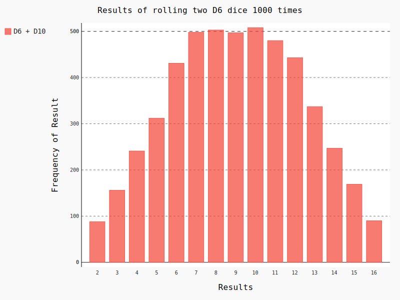
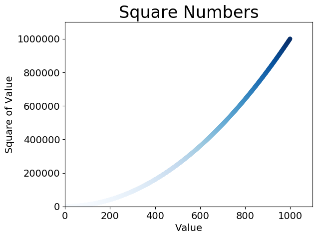
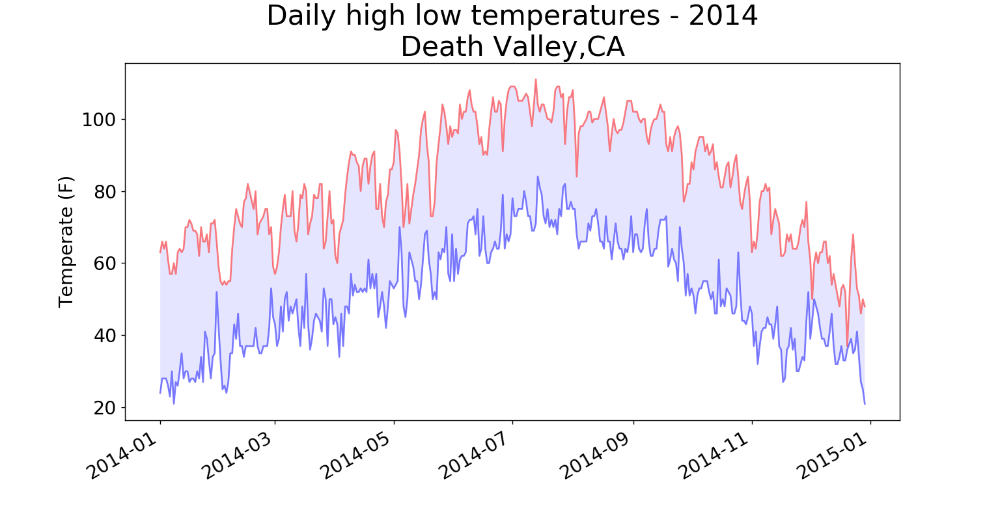
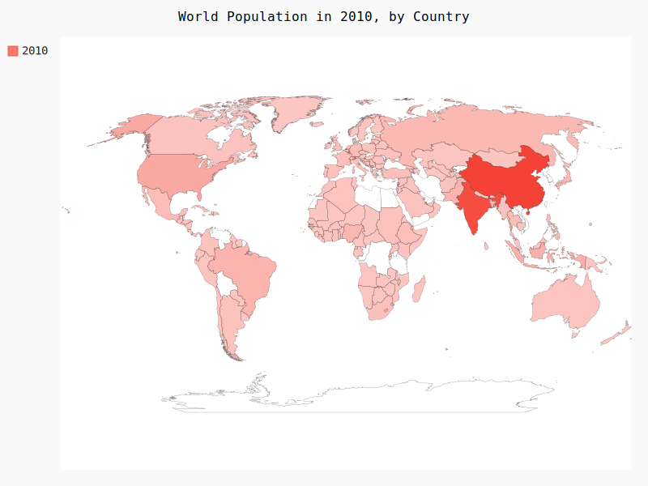

# Data Visualization

## 文件说明
  **create_data**
  生成数据，举例说明如何使用matplotlib绘图 
  
  
  
  
  **download_data**
  下载数据，从网上下载数据并进行可视化。主要访问并可视化两种数据格式：SCV和JSON.
  用csv模块处理CSV（逗号分隔的值）格式存储的天气数据，找出两个不同地区在一段时间内的最高温度和最低温度。然后，使用matplotlib根据下载的数据创建一个表格，展示两个不同地区的气温变化：阿里斯加戏卡特和加利福尼亚死亡谷.
  
  
  用json模块来访问JSON格存储的人口数据，并使用pygal绘制一幅按照国别划分的人口地图.
  
  
  
  **use API**
  使用Web应用编程接口（API）自动请求网站的特定信息而不是整个网页，再对这些数据进行可视.
  
  这里以GitHub网站信息为例.请求有关网站中Python项目的信息，然后使用Python生产交互可视化，以呈现这些项目的受欢迎程度.
  API调用地址:
  https://api.github.com/search/repositories?q=language:python&sort=stars
  

## 需要安装库
  根据使用的环境选择具体的安装文件，这里以64位window10 python3.5为例.
  
  matplotlib---https://pypi.python.org/packages/01/61/17337866a6e944240c16ab0278a2350fcef57516faef40acbe74824769eb/matplotlib-2.0.2-cp35-cp35m-win_amd64.whl#md5=d9e6dee01e05939a65ec363c5f561f4b
  
  pygal     ---https://pypi.python.org/packages/5f/b7/201c9254ac0d2b8ffa3bb2d528d23a4130876d9ba90bc28e99633f323f17/pygal-2.4.0-py2.py3-none-any.whl#md5=e029ee860a570f5bd325e35c3d1e3fa3
  
  pygal_maps_world
  
  requests  ---https://pypi.python.org/packages/5a/58/671011e3ff4a06e2969322267d78dcfda1bf4d1576551df1cce93cd7239d/requests-2.18.1-py2.py3-none-any.whl#md5=a7fbdc82134a2610b3d0cdc7e59f0bde
